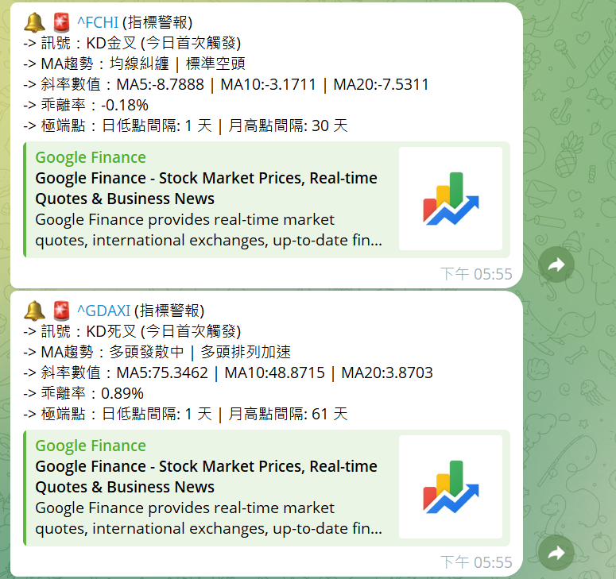
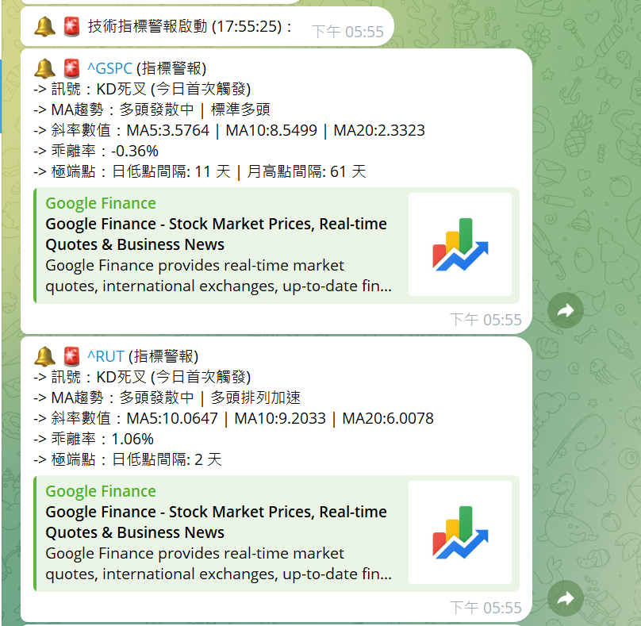
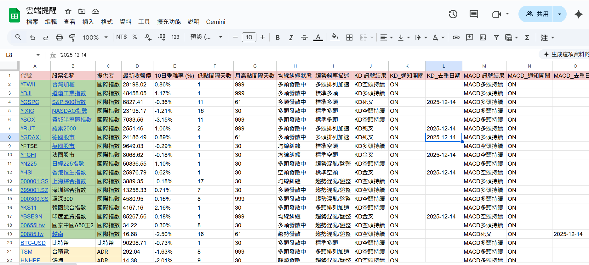
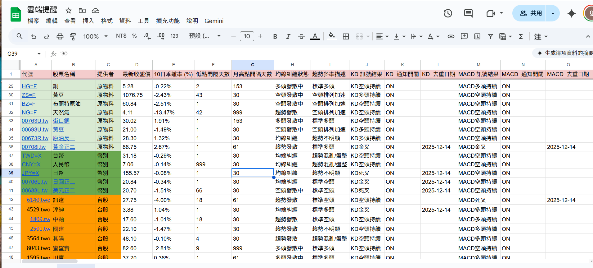
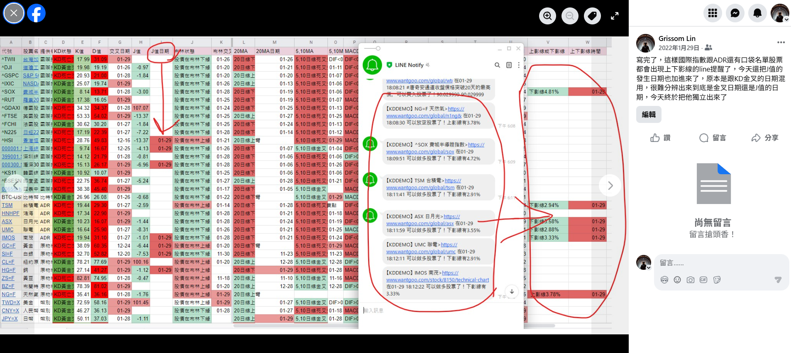

# stock-reminder-bot
---

## 📖 延伸閱讀 / Further Reading

本專案的詳細環境設定（Google API 申請、Telegram Bot 建立）與操作流程，請參考我撰寫的圖文教學：

👉 [**我的方格子文章 / My Vocus Articles**](https://vocus.cc/article/6949411ffd89780001244510)

> **教學內容包含：**
> * 如何取得 Google Cloud 服務帳戶金鑰 (JSON)
> * 如何建立 Telegram Bot 並獲取 Chat ID
> * 如何設定試算表與 Python 執行環境

A Telegram bot utilizing Python, yfinance, and TA-Lib to perform technical analysis on a Google Sheet list of stock tickers and send timely alerts via the APScheduler. (中文：🤖 一個 Telegram 機器人，用於對 Google Sheets 內的股票代號進行技術分析，並在指標觸發時即時發送警報通知。)

下圖是 Telegram 傳送的技術指標通知截圖，顯示雲端系統對台股標的的即時分析與警報。
The image below shows a Telegram-based technical indicator alert screenshot, displaying real-time cloud-based analysis and signal notifications for Taiwan-listed ETFs.

以下是程式在 Railway 平台上執行時的 log 訊息截圖：
The following is a screenshot of the program’s log messages while running on the Railway platform:

## 為什麼選擇 Google Sheets 作為操作介面？  
## Why Choose Google Sheets as the Operation Interface?

本專案使用 **Google Sheets** 作為主要操作介面，而不是建立獨立的資料庫或網頁系統，原因如下：  
This project uses **Google Sheets** as the main operation interface instead of building a separate database or web system, for the following reasons:

- **免建資料庫與網頁**  
  不需要額外開發後端資料庫或前端 CRUD 系統，降低維護成本。  
  **No need for database or web development**  
  No extra backend database or frontend CRUD system is required, reducing maintenance costs.

- **直觀的視覺化介面**  
  表格本身就是最簡單的 Dashboard，可以直接看到大盤狀態與技術指標。  
  **Intuitive visualization interface**  
  The spreadsheet itself serves as the simplest dashboard, directly showing market status and technical indicators.

- **操作方便**  
  新增或刪除股票只需在表格中增減列，修改通知開關只需編輯儲存格。  
  **Easy operation**  
  Adding or removing stocks only requires editing rows, and notification switches can be toggled by editing cells.

- **雲端同步與多人協作**  
  Google Sheets 天生支援多人同時編輯，無需額外的使用者管理系統。  
  **Cloud sync and collaboration**  
  Google Sheets natively supports multi-user editing without the need for an additional user management system.

- **輕量化、個人化的最佳解**  
  對個人或小型專案來說，Excel/Google Sheets 已經足夠，不必追求「高大上」的資料庫架構。  
  **Lightweight and personal-friendly solution**  
  For individuals or small projects, Excel/Google Sheets is sufficient without pursuing a complex database architecture.

👉 總結：Google Sheets 同時扮演 **資料存放處**、**操作介面**、**視覺化報表** 三種角色，讓系統設計更簡單、直觀且易於維護。  
👉 In summary: Google Sheets acts simultaneously as a **data repository**, **operation interface**, and **visual report**, making system design simpler, more intuitive, and easier to maintain.

### 舊版回顧 / Previous Version

📱 這張圖片是我幾年前開發的 **LINE Bot**，部署在 **Heroku** 平台，用來傳送股票技術指標的提醒訊息。  
後來因為 Heroku 開始收費，加上我專注在回測策略，這個版本就沒有再繼續維護。  

📱 This image shows the **LINE Bot** I developed a few years ago, deployed on the **Heroku** platform, which was used to send stock technical indicator alerts.  
Later, as Heroku introduced paid plans and I shifted my focus to backtesting strategies, this version was no longer maintained.

---

## 📖 延伸閱讀 / Further Reading 👉 [我的方格子文章 / My Vocus Articles](https://vocus.cc/salon/grissomlin/room/693e915f93e86fa746e87698)

📊 六大市場股票統計數據簡介 / Stock Market Statistics Overview

本研究並非僅分析單一指數走勢，而是以各市場主要指數作為市場代表與分類依據，
實際統計對象為各國交易所中數千家上市公司之個股資料，
透過大量樣本進行整體市場結構與動能行為的統計分析。

This study does not focus solely on index performance.
Instead, major indices are used as market representatives and classification references,
while the actual analysis is conducted on thousands of individual stocks listed in each market,
enabling large-sample statistical observations of market structure and momentum behavior.

中國 (China)

市場代表指數：滬深 300 (CSI 300)
作為中國股市的市場分類基準，
實際統計涵蓋上海與深圳交易所中大量 A 股上市公司，
用以分析整體市場動能分布與結構特徵。

Market Reference Index: CSI 300
Used as a market classification benchmark,
while the statistical analysis includes a large population of A-share stocks
from the Shanghai and Shenzhen exchanges.

香港 (Hong Kong)

市場代表指數：恒生指數 (HSI)
指數作為市場代表，
實際統計對象為香港交易所中廣泛的上市公司樣本，
涵蓋主板與主要產業族群。

Market Reference Index: Hang Seng Index (HSI)
Used as a market proxy,
with analysis conducted on a broad set of listed companies
across major sectors on the Hong Kong Exchange.

美國 (United States)

市場代表指數：道瓊工業指數、S&P 500、NASDAQ Composite
以多指數作為市場分類參考，
實際統計涵蓋 NYSE 與 NASDAQ 中數千家上市公司，
反映不同市值與產業結構下的市場行為。

Market Reference Indices: Dow Jones, S&P 500, NASDAQ Composite
Multiple indices are used for market classification,
while the analysis covers thousands of stocks listed on NYSE and NASDAQ,
capturing behaviors across market capitalizations and sectors.

韓國 (South Korea)

市場代表指數：KOSPI
作為市場結構參考指數，
實際統計對象涵蓋韓國交易所中大多數上市公司，
用於觀察市場整體趨勢與個股分布特性。

Market Reference Index: KOSPI
Used as a structural market reference,
with statistical analysis covering the majority of listed companies
on the Korea Exchange.

日本 (Japan)

市場代表指數：日經 225
作為市場分類與比較基準，
實際分析涵蓋東京證券交易所中大量上市企業樣本，
以捕捉市場長期與短期動能特徵。

Market Reference Index: Nikkei 225
Used as a comparative benchmark,
while analysis includes a broad sample of listed companies
on the Tokyo Stock Exchange.

台灣 (Taiwan)

市場代表指數：台灣加權指數 (^TWII)
指數作為市場代表與整體方向參考，
實際統計涵蓋台灣證券交易所中數千筆個股資料，
反映台股市場的整體結構與動能行為。

Market Reference Index: Taiwan Weighted Index (^TWII)
Used as a market proxy,
with statistical analysis conducted on thousands of individual stocks
listed on the Taiwan Stock Exchange.

